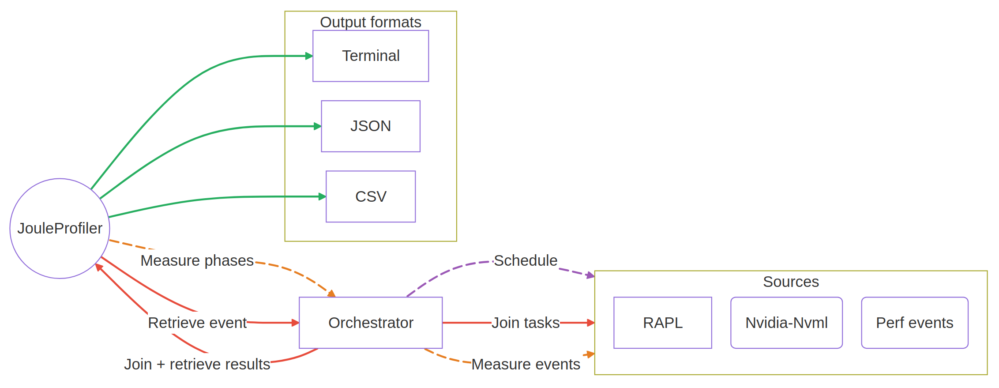

# Summary

Joule Profiler is a lightweight command-line tool for Linux measuring a running program's energy consumption. Designed to be as non-intrusive as possible in terms of instrumentation, it allows developers and researchers to better understand their software’s energy consumption without significant overhead. Joule Profiler enables users to decompose program execution into distinct phases, such as data loading, computation, and result generation, and to attribute energy consumption to each phase. It monitors the target program to detect user-defined phase triggers and automatically queries various sources, such as Intel RAPL for CPUs or NVML for GPUs, to report system-wide energy consumption.

# Statement of need  

The energy consumption of computing infrastructures has become a major concern for both research and industry. Programs deployed in clouds, data centres, and edge environments contribute significantly to global energy use. Improving their efficiency has become a key goal, and understanding how software uses energy requires tools that can measure consumption during execution. Modern CPUs and GPUs provide hardware counters via interfaces such as Intel RAPL, enabling software-based energy measurement without external hardware.  

Researchers and developers aiming to optimise energy consumption may need a simple tool to measure the energy use of code segments without deploying a full monitoring infrastructure. Joule Profiler covers this gap by implementing a phase-based energy profiling tool that integrates easily into experimental workflows.  

# State of the field  

Numerous tools use these counters to monitor energy. PowerAPI [@powerapi] offers infrastructure for monitoring and attributing energy consumption in distributed systems. Alumet [@alumet] provides a framework for measuring energy and studying the reliability of software-based measurement. Scaphandre [@scaphandre] exports energy metrics for hosts and containers for integration with observability platforms like Prometheus. EnergiBridge [@sallou_energibridge_2024] provides cross-platform energy measurement via a command-line wrapper. JouleIt [@jouleit], the direct predecessor that inspired this work, demonstrated the viability of a lightweight wrapper approach but lacks phase decomposition, GPU support, and a modular source architecture.  

While these solutions are invaluable for system-level monitoring, they are designed for observability rather than fine-grained analysis of a program's internal execution. In particular, they lack a lightweight way to associate energy consumption with specific program phases. Contributing this capability to an existing framework was considered; these tools target daemon-based or fleet-level monitoring, whereas Joule Profiler is designed for minimal-footprint, single-invocation use in experimental workflows.

# Phase-based profiling

\begin{figure}
	\centering
	\includegraphics[width=\linewidth]{images/phases.png}
	\caption{Process lifecycle illustrating sequential phases}
	\label{fig:phases}
\end{figure}

Energy consumption measurements are conventionally presented in two ways: either the full energy consumed by the program, or as power readings taken at regular intervals. These approaches give a general view but do not reveal which parts of a program are the most energy-intensive. Joule Profiler introduces phase-based energy profiling, allowing users to decompose program execution into logical phases with minimal instrumentation. Instead of requiring instrumentation libraries or intrusive code changes, it watches the program’s standard output to detect phase boundaries.

During execution, Joule Profiler reads the program’s standard output and matches each line against user-defined regular expressions to detect phase boundaries. If the program does not naturally produce output on the standard output, developers can simply add print statements at key points, for example, at the beginning of execution or before major computation steps, so that phases can still be identified.

When a phase marker is detected, Joule Profiler records the current energy counter values, meaning metrics are collected only at these phase boundaries rather than continuously \autoref{fig:phases}. After the program finishes, it computes the energy consumption for each phase by subtracting the recorded energy counters (e.g., RAPL, NVML).

# Software design

Joule Profiler has been designed to be modular. It collects energy and performance metrics from multiple hardware sources while keeping overhead low. To simplify extension and maintenance, the measurement logic is isolated from the hardware-specific implementations. Joule Profiler accesses RAPL counters via the `perf_event` interface [@linux_perf_event], which exposes hardware performance monitoring facilities. If `perf_event` is unavailable, the tool falls back to the powercap interface in Linux `sysfs` [@linux_powercap]. For NVIDIA GPUs, it uses the *NVIDIA Management Library* (NVML)[@nvidia_nvml] to retrieve power consumption on compatible hardware. Joule Profiler can also collect hardware performance counters via `perf_event`, allowing energy measurements to be correlated with performance events or split proportionally when multiple components contribute.

{ width=90% }

Internally, the tool is divided into layers. The core layer handles the main logic: detecting phases, aggregating metrics, and coordinating the measurement sources. Each source runs as an asynchronous task, enabling parallel data collection and maintaining temporal precision. The *Command-Line Interface* (CLI) layer manages user interaction, parses configuration options, and displays results. A source abstraction layer encapsulates each hardware backend, such as RAPL, NVML, or performance counters, in a separate module. This separation eases the integration of new sources in the future without affecting the rest of the system.

# Validity of the energy measurement

To assess the validity of the measurements, Joule Profiler was compared against two reference tools for energy measurement on Linux: perf[@perfwiki] and Alumet[@alumet]. These tools rely on the same underlying RAPL hardware counters, but use different measurement strategies and software stacks. Comparing their measures, therefore, allows us to evaluate whether Joule Profiler introduces additional measurement bias.

Three experimental scenarios were evaluated. In the first scenario, Joule Profiler and perf were executed alongside a simple sleep command while a CPU-intensive workload was running in the background, and Joule Profiler and Alumet were executed the same way with a GPU-intensive workload. This configuration ensured that each pair of tools observed identical hardware activity and was subject to the same measurement noise.

In the second scenario, we compared Joule Profiler against perf and Alumet in sequence with an intensive workload. We pinned the workload to a single CPU core to reduce variability. This scenario allows us to evaluate the overhead of Joule Profiler and compare it to the baseline tools.

In the last scenario, we used a custom workload that generated periodic outputs, identifiable as phases, to assess the instrumentation's precision through tokens printed to the standard output.

All experiments were conducted on the Grid'5000 platform, using nodes from the Chirop and Chifflot clusters located at the Lille site. Chirop nodes are equipped with 2 Intel Xeon Platinum 8358 processors supporting the RAPL interface and 512 GiB of memory, while Chifflot nodes contain 2 Nvidia Tesla V100 GPUs compatible with the NVML library and 192 GiB of memory.

Energy measurements were collected from the `PACKAGE` and `DRAM` domains using RAPL hardware counters, and from the GPU using NVML. Joule Profiler was configured to access these counters through the `perf_event` interface and to retrieve GPU energy consumption. To reduce energy measurement variability, hyper-threading was disabled, and the CPU frequency was set to its maximum using the performance governor.

## Total energy comparison

### Parallel execution

In the first scenario, we compared the total energy consumption reported during the parallel execution of a 10-second sleep command. We performed 4000 measurements to achieve 80% statistical power and used a *Two One-Sided Tests* (TOST) procedure with an acceptable difference of 0.1% of perf and Alumet mean values to assess whether the measurements were equivalent.

\begin{figure}
	\centering
	\includegraphics[width=\linewidth]{images/full_comparison_parallel.pdf}
	\caption{Empirical Cumulative Distribution Function (ECDF) of energy measurements (J) across RAPL domains (DRAM, PACKAGE) comparing perf and Joule Profiler, and GPU comparing Alumet and Joule Profiler.}
	\label{fig:rapl_energy_distribution}
\end{figure}

\begin{figure}
	\centering
	\includegraphics[width=\linewidth]{images/full_comparison_parallel2.pdf}
	\caption{Bland–Altman analysis of energy measurements (J) across RAPL domains (DRAM, PACKAGE) comparing perf and Joule Profiler, and GPU comparing Alumet and Joule Profiler.}
	\label{fig:rapl_bland_altman}
\end{figure}

\autoref{fig:rapl_energy_distribution} shows the empirical cumulative distribution of energy measurements reported by perf and Joule Profiler for both the `PACKAGE-0` and `DRAM-0` RAPL domains, and by Alumet and Joule Profiler for `GPU-0` over repeated runs of the benchmark. For `DRAM-0`, both tools consistently report values close to 157.15 J, with overlapping distributions and low variance. For `PACKAGE-0`, both reports show values around 1008 J. As for `GPU-0`, both Alumet and Joule Profiler span around 1550 J.

\autoref{fig:rapl_bland_altman} presents a Bland-Altman analysis of the agreement between the two tools. For `DRAM-0`, the bias is 0.013 J and 96.8% of measurements fall within the *Limits of Agreement* (LoA), which span approximately ±0.039 J. For `PACKAGE-0`, the bias is close to 0.046 J, and the LoA range is 0.3 J, but a subset of measurements falls outside these limits, with differences reaching approximately 1.04 J.
These results indicate that Joule Profiler and perf are in close agreement for `DRAM` energy measurement. For the `PACKAGE` domain, agreement holds for the majority of runs, though higher variability is observed at high energy values, consistent with the known noise characteristics of RAPL measurements at the package level. Also, 95.8% of the measures fall within the LoA interval, demonstrating agreement between perf and Joule Profiler measurements.
For `GPU-0`, the LoA is around ±4.29 J, with a bias of 1.39 J, due to a high variation of 1.95% in measurements for both tools. Nonetheless, 94.5% of values are contained within the LoA. Furthermore, for RAPL domains, the coefficient of variation of both tools is similar, with approximately 0.35% for `DRAM-0`, 0.49% for `PACKAGE-0`.
The null hypotheses of non-equivalence of the TOST procedure were rejected, indicating statistical equivalence within the predefined margin. A small correlation-adjusted effect size was observed for all domains: 0.024 for `DRAM-0`, 0.009 for `PACKAGE-0`, and 0.046 for `GPU-0`. Moreover, the Pearson correlation between perf and Joule Profiler exceeded 99.9% for both RAPL domains. For `GPU-0`, the correlation with Alumet reached 99.5%. These results confirm that Joule Profiler does not introduce a significant measurement bias, thus demonstrating the reliability of its measurements.

### Sequential execution

While the parallel execution assesses the reliability of measurement, sequential execution is used to evaluate the overhead and the variability of Joule Profiler. In that regard, we executed Joule Profiler, perf, and Alumet 2,000 times in sequence and compared their distributions and variability.

\begin{figure}
	\centering
	\includegraphics[width=0.9\linewidth]{images/full_comparison_sequential.pdf}
	\caption{Energy distribution (J) across RAPL domains (DRAM, PACKAGE) and GPU comparing perf, Alumet, and Joule Profiler.}
	\label{fig:sequential_comparison}
\end{figure}

\autoref{fig:sequential_comparison} presents the energy distributions of perf, Joule Profiler, and Alumet across sequential runs for RAPL domains and the GPU. As for the parallel scenario, all tools report nearly identical values, with differences of less than 0.1% for RAPL domains and 0.5% for GPU. The sequential execution results show that Joule Profiler does not introduce a significant overhead compared to Alumet and perf.

## Phase attribution precision

In the third scenario, we aimed to evaluate whether instrumentation based on printed outputs is sufficiently accurate to precisely identify the different phases of a program. To this end, we wrote a custom program that spawns a child process, printing periodic tokens containing the current timestamp at a fixed frequency from 100 Hz to 1,000 Hz, incrementing by 100 Hz. The parent process listens only for lines on standard output. We then compared each timestamp made by the child process to the timestamp at which the parent process detects the output. This comparison allowed us to quantify the delay between the program’s execution events and the associated measurements, thereby assessing the instrumentation's temporal accuracy and responsiveness. Then, we repeated the measurement with the Joule Profiler and compared the phase delays with the baseline. Afterwards, we executed this scenario a second time with a stress-ng workload on each core, using the baseline to see how CPU frequency affects the phase detection delay. To achieve 80% statistical power, both execution strategies were conducted 40 times from 100 Hz to 1,000 Hz with a step of 100 Hz, with 10,000 measures per frequency per iteration.

\begin{figure}
	\centering
	\includegraphics[width=0.8\linewidth]{images/phase_delay_comparison.pdf}
	\caption{Median, first and last quartiles delay between phase detection time and real phase start.}
	\label{fig:phase_delay}
\end{figure}

\autoref{fig:phase_delay} displays the distribution of delays between the detection and the real start of a phase. At the baseline, the median delay is around 25 μs at 100 Hz and remains almost constant at 24 μs at 1,000 Hz. This result indicates that the delay remains acceptable, as the phase duration should not be lower than 1 millisecond due to the RAPL counters' refresh rate of 1,000 Hz. We also evaluated the delay introduced by Joule Profiler using the same custom program. \autoref{fig:phase_delay} shows that Joule Profiler introduces an additional median delay of 11 μs for each frequency. At frequencies higher than 800 Hz, Joule Profiler's first quartile delay matches the baseline delay. However, while the baseline has a constant coefficient of variation around 20%, Joule Profiler's increases at high frequencies, from 23% from 100 to 800 Hz to 28% at 1,000 Hz. This lower delay of Joule Profiler at high frequencies is likely due to CPU wakeups, because Joule Profiler is less idle than the baseline, leading to more frequent scheduling activity and reduced idle-state latency, which in turn shortens the observed delay but increases its variability. This idle-state latency is confirmed by the second execution of the scenario. \autoref{fig:phase_delay} shows that running a stress-ng workload on each core reduces the phase-detection delay to 2 μs for the baseline. For Joule Profiler, the delay decreases to 3 μs at frequencies below 700 Hz. For higher frequencies, up to 1,000 Hz, the delay matches the baseline's with 2 μs. However, the stress-ng workload introduces more variation in the phase-detection delay, due to high outliers. As a result, running Joule Profiler on a high-frequency CPU core reduces the phase-detection delay. These results confirm that instrumentation based on printed outputs is viable for workloads with phase durations above 1 ms, which is consistent with the RAPL counter refresh rate.

# Research impact statement  

Joule Profiler has been developed at [Inria](https://www.inria.fr/fr) and the [University of Lille](https://www.univ-lille.fr) with support from the France 2030 program under grant agreement `ANR-23-PECL-0003` ([CARECloud](https://carecloud.irisa.fr) project of the [PEPR CLOUD](https://pepr-cloud.fr/) research program), where it is used to benchmark the energy consumption of _Function-as-a-Service_ (FaaS) workloads, providing the phase-granularity required to isolate initialisation, execution, and teardown costs in reproducible experiments. This work is also carried out in the context of the PULSE project, a collaboration between [Inria](https://www.inria.fr/fr) and [Qarnot Computing](https://qarnot.com) focused on energy-aware software engineering for heterogeneous computing environments ([https://defi-pulse.github.io/](https://defi-pulse.github.io/)). 

The [Grid'5000 testbed](https://www.grid5000.fr/w/Grid5000:Home) and [SLICES-FR](https://slices-fr.eu), on which all validation experiments were conducted, are a shared national research infrastructure used by dozens of teams across France. Joule Profiler's compatibility with Grid'5000 nodes (Intel Xeon RAPL, NVIDIA Tesla NVML) is intentional, and the tool is designed to integrate directly into the experimental workflows common on this platform.  

The software is released as open-source under the MIT license and is available at [https://github.com/joule-profiler/joule-profiler](https://github.com/joule-profiler/joule-profiler), with versioned releases, a public changelog, and user-facing documentation.

# AI Usage Disclosure

This submission made limited use of generative AI tools during the early stages of the project.

**Tool identification.**  
The authors used Claude Sonnet 4.5 (Anthropic) as a generative AI assistant during the project bootstrap phase.

**Scope of assistance.**  
The AI system was used to suggest an initial repository structure and generate preliminary boilerplate code used to bootstrap the project. It also provided guidance on organising the project during early development.

**Human verification and oversight.**  
All AI-generated outputs were thoroughly reviewed, modified, and validated by the authors. Human authors made all architectural, design, and implementation decisions and ensured that the final code, documentation, and manuscript content met the project’s scientific, technical, and licensing standards.

The authors take full responsibility for the accuracy, originality, and integrity of the submitted work.

# Acknowledgements  

This work received support from the France 2030 program, managed by the French National Research Agency under grant agreement No. `ANR-23-PECL-0003` (PEPR CLOUD CARECloud), and from the Inria – Qarnot PULSE project: [https://www.inria.fr/en/pulse](https://www.inria.fr/en/pulse), [https://defi-pulse.github.io/](https://defi-pulse.github.io/).  

Experiments presented in this paper were carried out using the Grid'5000 testbed, supported by a scientific interest group hosted by Inria and including CNRS, RENATER, and several Universities, as well as other organisations (see [https://www.grid5000.fr](https://www.grid5000.fr)).

# References